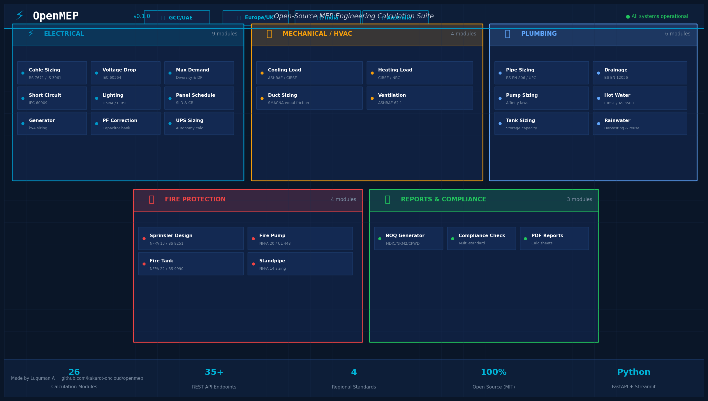
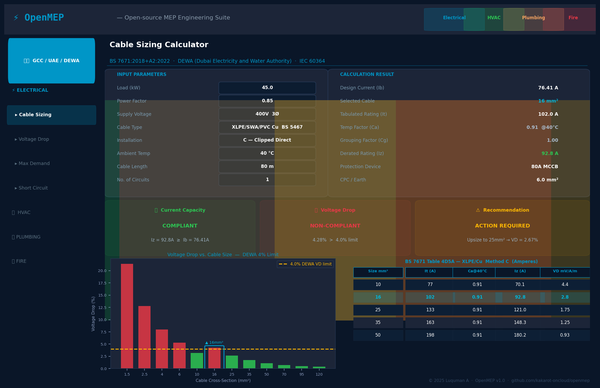
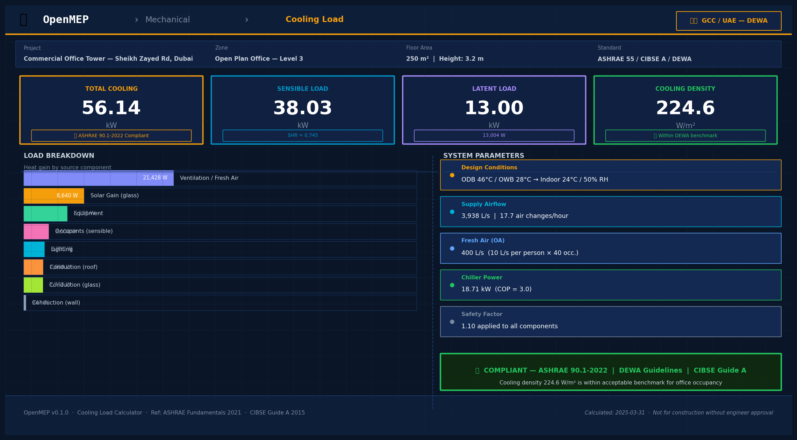
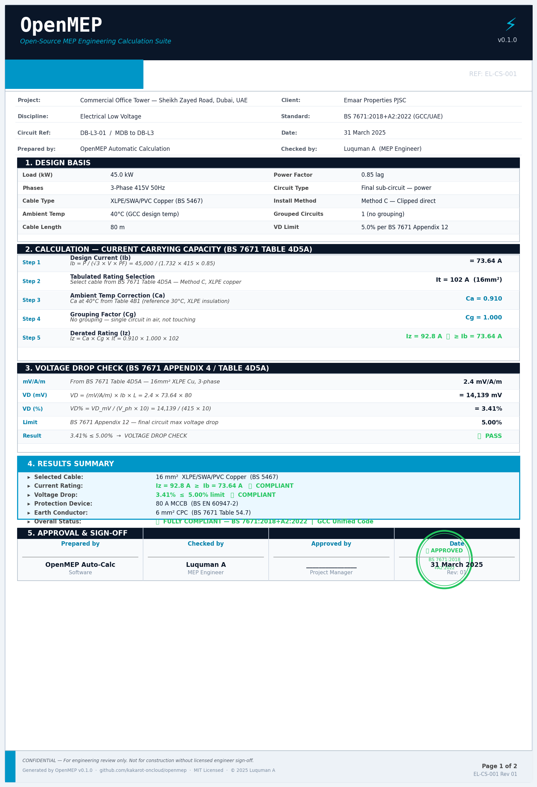

<div align="center">

```
 ██████╗ ██████╗ ███████╗███╗   ██╗███╗   ███╗███████╗██████╗
██╔═══██╗██╔══██╗██╔════╝████╗  ██║████╗ ████║██╔════╝██╔══██╗
██║   ██║██████╔╝█████╗  ██╔██╗ ██║██╔████╔██║█████╗  ██████╔╝
██║   ██║██╔═══╝ ██╔══╝  ██║╚██╗██║██║╚██╔╝██║██╔══╝  ██╔═══╝
╚██████╔╝██║     ███████╗██║ ╚████║██║ ╚═╝ ██║███████╗██║
 ╚═════╝ ╚═╝     ╚══════╝╚═╝  ╚═══╝╚═╝     ╚═╝╚══════╝╚═╝
```

**Open-source MEP engineering calculation suite · 4 regions · 26 modules · 7 platform features · production-ready**

[](https://github.com/kakarot-oncloud/openmep/releases)
[](https://github.com/kakarot-oncloud/openmep/actions/workflows/ci.yml)
[](https://python.org)
[](https://fastapi.tiangolo.com)
[](https://streamlit.io)
[](LICENSE)

[](#region-support)
[](#modules)
[](#platform-features)
[](https://codecov.io/gh/kakarot-oncloud/openmep)

[**🌐 Project Website**](https://kakarot-oncloud.github.io/openmep/) · [**📄 API Docs**](docs/API_DOCS.md) · [**📦 Deployment Guide**](docs/DEPLOYMENT.md) · [**📖 User Guide**](docs/USER_GUIDE.md) · [**📐 Standards Reference**](docs/STANDARDS_REFERENCE.md)

</div>

---

## Who is this for?

> **MEP consultants, design engineers, contractors, and BIM coordinators** working across GCC, Europe/UK, India, and Australia/NZ.

If you size cables, calculate cooling loads, design pipe systems, or specify fire protection — OpenMEP replaces tedious spreadsheets with a standards-compliant, API-driven calculation engine. Results cite the exact code clause. Reports are print-ready. Everything is open source.

---

## Screenshots

<table>
  <tr>
    <td align="center"><br/><sub>Module Dashboard</sub></td>
    <td align="center"><br/><sub>Cable Sizing — 4-region comparison</sub></td>
  </tr>
  <tr>
    <td align="center"><br/><sub>HVAC Cooling Load</sub></td>
    <td align="center"><br/><sub>Auto-generated PDF Calculation Report</sub></td>
  </tr>
</table>

> Full animated walkthrough → [`docs/assets/openmep_demo.gif`](docs/assets/openmep_demo.gif)

---

## Why OpenMEP?

Commercial MEP tools cost thousands per seat and lock results in proprietary formats. OpenMEP is built on three principles:

- **Region-aware** — design codes switch automatically: BS 7671 for GCC/UK, IS 3961 for India, AS/NZS 3008 for Australia. Three-level selector: Region → Country/State → Utility/Authority.
- **Standard-cited** — every result references the exact clause and table used. Full numerical tables (ampacity, correction factors, pressure drop, etc.) are embedded directly in the codebase — no external lookups.
- **Audit-ready** — one-click PDF reports with letterhead, step-by-step calculation workings, and an engineer sign-off block.

---

## Modules

### Electrical (9)

| # | Module | Standards |
|---|--------|-----------|
| 1 | Cable Sizing | BS 7671 / IEC 60364 / IS 3961 / AS/NZS 3008 |
| 2 | Voltage Drop | IEC 60364-5-52 |
| 3 | Maximum Demand | IEE / DEWA / IS 18–1 |
| 4 | Short Circuit | IEC 60909 |
| 5 | Lighting Design | CIBSE LG7 / IS 3646 |
| 6 | Power Factor Correction | IEEE 1459 |
| 7 | Generator Sizing | IEC 60034 |
| 8 | UPS Sizing | IEC 62040 |
| 9 | Panel Schedule | Multi-region |

### Mechanical / HVAC (4)

| # | Module | Standards |
|---|--------|-----------|
| 10 | Cooling Load | ASHRAE 90.1 / CIBSE Guide A |
| 11 | Duct Sizing | SMACNA / CIBSE Guide C |
| 12 | Heating Load | EN 12831 / CIBSE Guide A |
| 13 | Ventilation | ASHRAE 62.1 |

### Plumbing (6)

| # | Module | Standards |
|---|--------|-----------|
| 14 | Pipe Sizing | BS EN 806 / IS 1172 |
| 15 | Drainage Sizing | BS EN 12056 |
| 16 | Pump Sizing | Darcy-Weisbach |
| 17 | Hot Water System | BS EN 806-3 |
| 18 | Rainwater Harvesting | BS 8515 / AS 3500 |
| 19 | Plumbing Tank Sizing | BS EN 806 / IS 1172 |

### Fire Protection (4)

| # | Module | Standards |
|---|--------|-----------|
| 20 | Sprinkler Design | BS EN 12845 / NFPA 13 |
| 21 | Fire Pump Sizing | BS EN 12845 / NFPA 20 |
| 22 | Fire Storage Tank | BS 9251 / NBC 2016 |
| 23 | Standpipe System | NFPA 14 / BS 9990 |

### Reports & Compliance (3)

| # | Module | What it does |
|---|--------|-------------|
| 24 | BOQ Generator | Bill of Quantities in FIDIC / NRM2 / CPWD / AIQS format |
| 25 | Compliance Checker | Validates all module results against regional limits, flags the exact failing clause |
| 26 | PDF Reports + Submittal Tracker | A4 calc sheets with letterhead and sign-off; submittal log with status tracking |

---

## Platform Features

Seven features that sit across all calculation modules, turning individual results into a complete project workflow.

### 1 · Project Workspace — Single Source of Truth

Store your building data once: project name, region, number of floors, space types, and design conditions. Every calculation module reads from the workspace automatically — change the region or ambient temperature and all 26 modules update without re-entering data.

- **REST API:** `POST /api/projects` · `GET /api/projects/{id}` · `PUT /api/projects/{id}`
- **Streamlit:** *Project Workspace* page — fill in once, use everywhere
- Persists between sessions; JSON export for archiving

### 2 · Submission Packager

One click generates a ready-to-send ZIP archive containing:
- All calculation PDFs for the project
- Cover letter (auto-populated with project metadata)
- Cross-module compliance matrix
- BOQ summary sheet
- Version log (who ran what and when)

```bash
curl -X POST http://localhost:8080/api/submission/package \
  -H "Content-Type: application/json" \
  -d '{"projectId": "proj_abc123", "includeModules": ["electrical","mechanical","fire"]}'
# Returns a downloadable ZIP
```

### 3 · Compliance Guardian

Runs automatically before every submission package is built. Checks every module result against the regional authority limits and flags any breach with the exact standard clause.

| Check | Example rule |
|-------|-------------|
| Voltage drop | DEWA §4.3.2 — max 2.5 % for final circuits |
| Cable temperature | IS 732 §6.4 — ambient derating mandatory above 40 °C |
| Sprinkler spacing | NFPA 13 §8.6.3 — max 4.6 m centre-to-centre |
| Pipe velocity | AS/NZS 3500 §3.4 — max 3 m/s cold water |

Returns structured JSON with `PASS`, `WARN`, and `FAIL` per module — the Streamlit UI shows a colour-coded summary.

```bash
curl -X POST http://localhost:8080/api/submission/compliance-check \
  -H "Content-Type: application/json" \
  -d '{"moduleResults": [{"module":"electrical","region":"DEWA","parameters":{"voltage_drop_percent":3.1}}]}'
```

### 4 · BIM / IFC & CSV Bridge

**Import:** Upload an IFC file or a Revit schedule CSV — the bridge extracts room data, floor counts, space categories, and design loads and auto-populates the Project Workspace. No manual re-entry from the BIM model.

**Export:** Download calculated results as:
- CSV (column-per-parameter, ready for Excel or Revit lookup tables)
- IFC property sets (`.ifc`) ready to import back into Revit or ArchiCAD

```bash
# Import from IFC (Node.js API — port 8080)
curl -X POST http://localhost:8080/api/bim/import \
  -F "file=@building_model.ifc" \
  -F "projectId=proj_abc123"

# Export results as CSV
curl "http://localhost:8080/api/bim/export/csv?projectId=proj_abc123&module=electrical"

# Export as IFC property sets
curl "http://localhost:8080/api/bim/export/ifc?projectId=proj_abc123"
```

### 5 · Value Engineering & Cost Optimizer

After every calculation, the optimizer scans compliant alternatives and ranks them by estimated cost saving in the local currency (AED, INR, GBP, AUD). Every suggestion is rule-based and cites the standard that makes it valid — no AI guessing.

Example output for a cable sizing result:

| Option | Cable | Saving (AED) | Standard basis |
|--------|-------|-------------|----------------|
| Current | 70 mm² XLPE/Cu | — | BS 7671 Table 4D5A |
| **Option A** | 50 mm² XLPE/Al | **−18%** | BS 7671 §523.6 — Al permitted for ≥16 mm² |
| Option B | 70 mm² XLPE/Al | −11% | BS 7671 §523.6 |

```bash
curl -X POST http://localhost:8080/api/optimize/electrical \
  -H "Content-Type: application/json" \
  -d '{"projectId":"proj_abc123","region":"gcc","load_kw":45,"cable_type":"XLPE_CU"}'
```

### 6 · Project Version History

Full audit trail of every project configuration state. Each save captures project metadata, engineering parameters, compliance status, and a BOQ snapshot with cost deltas (e.g. _BOQ +AED 124,000_ between versions). Includes a diff viewer comparing any two versions.

- **REST API:** `POST /api/projects/{id}/versions` · `GET /api/projects/{id}/versions`
- **Streamlit:** *Version History* page (page 27)
- Version numbers are sequential and append-only — no overwriting

### 7 · Company Branding & Report Templates

Firms store a logo, stamp image, primary colour hex code, and footer text once per project. Every PDF calculation report — cable sizing, cooling load, fire protection, and the rest — auto-injects the branding (branded letterhead, stamp block, coloured headings, custom footer). Custom report templates let you define per-client header/footer overrides.

- **REST API:** `POST/GET /api/projects/{id}/branding` · `POST/GET /api/projects/{id}/templates`
- **Streamlit:** *Company Branding* (page 28) · *Report Templates* (page 29)
- Supports logo, letterhead, and stamp as base64-encoded images

---

## Region Support

| Region | Coverage | Standards | Design Temp |
|--------|----------|-----------|-------------|
| [**GCC**](docs/regions/GCC_GUIDE.md) | UAE · KSA · Qatar · Kuwait · Bahrain · Oman | BS 7671, IEC 60364, DEWA / ADDC / SEC / KAHRAMAA, NFPA | 50 °C |
| [**Europe / UK**](docs/regions/EUROPE_GUIDE.md) | UK · Ireland · Germany · France · Netherlands · Nordics | BS 7671:2018+A2:2022, IEC 60364, CIBSE, EN 12831 | 30 °C |
| [**India**](docs/regions/INDIA_GUIDE.md) | All states + UTs (9 utility zones) | IS 3961, IS 732, IS 1646, NBC 2016, CPWD DSR | 45 °C |
| [**Australia / NZ**](docs/regions/AUSTRALIA_GUIDE.md) | All states + New Zealand | AS/NZS 3008, AS/NZS 3000, AS 3500, BCA/NCC | 40 °C |

Three-level region selector:
```
GCC        → UAE    → DEWA (Dubai) / ADDC (Abu Dhabi) / SEWA (Sharjah)
           → KSA    → SEC
           → Qatar  → KAHRAMAA
India      → Maharashtra → MSEDCL
           → Karnataka   → BESCOM
Australia  → NSW    → Ausgrid / Endeavour Energy
           → VIC    → CitiPower / Powercor
```

---

## Standards Inside the Code

All regional adapters embed the full numerical tables from the published standards — no placeholders, no external lookups. Example from [`backend/adapters/gcc/`](backend/adapters/gcc/):

**BS 7671 Table 4D5A — XLPE/Cu 3-phase ampacity & voltage drop**

| mm² | Method C (A) | Method E (A) | VD (mV/A/m) |
|-----|-------------|-------------|-------------|
| 2.5 | 34 | 39 | 18.0 |
| 10  | 77 | 88 | 4.4  |
| 25  | 133 | 152 | 1.75 |
| 50  | 198 | 227 | 0.93 |
| 95  | 306 | 352 | 0.47 |
| 185 | 448 | 516 | 0.24 |

**Temperature correction Ca (XLPE, ref 30 °C):** 40 °C → 0.91 · 45 °C → 0.87 · 50 °C → 0.82

Full standards reference → [**docs/STANDARDS_REFERENCE.md**](docs/STANDARDS_REFERENCE.md)

---

## Quick Start

```bash
git clone https://github.com/kakarot-oncloud/openmep.git
cd openmep
pip install -r requirements.txt

# Terminal 1 — API backend
uvicorn backend.main:app --reload --host 0.0.0.0 --port 8000

# Terminal 2 — Streamlit UI
streamlit run streamlit_app/app.py

# Terminal 3 — Node.js Project Management API (optional, needed for Platform Features)
cd src && npm install && npm run dev
```

- **UI** → http://localhost:8501
- **API (Swagger)** → http://localhost:8000/docs
- **Node.js API** → http://localhost:8080 *(projects, versioning, submission, branding)*

**Docker (single command):**
```bash
cp .env.example .env
# Set POSTGRES_PASSWORD in .env before running
docker-compose up -d
```

Once all containers are healthy:
| Service | URL | Description |
|---------|-----|-------------|
| Streamlit UI | http://localhost:8501 | Main web interface |
| FastAPI (Python) | http://localhost:8000/docs | Calculation engine — Swagger UI |
| Node.js API | http://localhost:8080 | Project management API |

**Google Colab — zero install:**

[](https://colab.research.google.com/github/kakarot-oncloud/openmep/blob/main/colab_launcher.ipynb)

---

## Sample API Calls

Full reference → [**docs/API_DOCS.md**](docs/API_DOCS.md)

```bash
# Cable sizing — GCC/DEWA, 45 kW, XLPE/Cu, 80 m run
curl -X POST http://localhost:8000/api/electrical/cable-sizing \
  -H "Content-Type: application/json" \
  -d '{"region":"gcc","sub_region":"dewa","load_kw":45,"power_factor":0.85,"phases":3,"cable_type":"XLPE_CU","installation_method":"C","cable_length_m":80,"ambient_temp_c":40}'

# Cooling load — ASHRAE, 500 m² open plan
curl -X POST http://localhost:8000/api/mechanical/cooling-load \
  -H "Content-Type: application/json" \
  -d '{"region":"gcc","area_m2":500,"occupancy":"office","glazing_ratio":0.4,"floor":5}'

# Sprinkler design — light hazard, BS EN 12845
curl -X POST http://localhost:8000/api/fire/sprinkler \
  -H "Content-Type: application/json" \
  -d '{"region":"gcc","hazard_class":"light","area_m2":600,"coverage_per_head_m2":12}'

# Create a project workspace
curl -X POST http://localhost:8080/api/projects \
  -H "Content-Type: application/json" \
  -d '{"name":"Tower A","region":"gcc","subRegion":"dewa","totalFloors":28,"totalAreaM2":32000}'

# Run compliance check (Node.js API — port 8080)
curl -X POST http://localhost:8080/api/submission/compliance-check \
  -H "Content-Type: application/json" \
  -d '{"moduleResults":[{"module":"electrical","region":"DEWA","parameters":{"voltage_drop_percent":3.1}}]}'

# Get value engineering options (Node.js API — port 8080)
curl -X POST http://localhost:8080/api/optimize/electrical \
  -H "Content-Type: application/json" \
  -d '{"projectId":"proj_abc123","region":"gcc","load_kw":45,"cable_type":"XLPE_CU"}'
```

**Rate limit:** 60 req/min per IP. Returns HTTP 429 with `Retry-After` on breach.

---

## Security

### API Key Authentication

The API supports optional `X-API-Key` authentication. Set the `API_KEY` environment variable to require the header on all calculation endpoints. Health check and documentation endpoints remain public.

```bash
# Generate a key and add to .env
echo "API_KEY=$(python -c "import secrets; print(secrets.token_urlsafe(32))")" >> .env

# Authenticated request:
curl -X POST http://localhost:8000/api/electrical/cable-sizing \\
  -H "X-API-Key: $API_KEY" \\
  -H "Content-Type: application/json" \\
  -d '{"region":"gcc","load_kw":45,...}'

# /health and /docs are always public — no key required
```

When `API_KEY` is **not** set (the default), the API is open — appropriate for local development and deployments on private networks.

### Container Security

Docker containers run as a non-root user (`appuser`). Each service in `docker-compose.yml` runs a single process — no `sh -c "... & ..."` anti-patterns.

See [SECURITY.md](SECURITY.md) for the full disclosure policy.

---

## Deployment

| Platform | Best For | Effort |
|----------|----------|--------|
| Local | Development, evaluation | ⭐ Easiest |
| Google Colab | Zero-install, one-off calcs | ⭐ Easiest |
| Streamlit Cloud | Free hosted UI | ⭐ Easiest |
| Docker | Teams, self-hosted | ⭐⭐ Easy |
| Ubuntu VPS | Production, HTTPS | ⭐⭐ Intermediate |
| Termux (Android) | Full install on phone | ⭐ Easiest |

Full instructions → [**docs/DEPLOYMENT.md**](docs/DEPLOYMENT.md)

---

## Project Structure

```
openmep/
├── backend/
│   ├── main.py                      # FastAPI entry — rate limiting, CORS
│   ├── api/routes/                  # REST endpoints
│   │   ├── electrical.py            # 9 electrical modules
│   │   ├── mechanical.py            # HVAC modules
│   │   ├── plumbing.py              # Plumbing modules
│   │   ├── fire.py                  # Fire protection modules
│   │   ├── boq.py                   # BOQ generator
│   │   ├── compliance.py            # Compliance checker
│   │   └── reports.py               # PDF report generation
│   ├── engines/                     # Pure-Python calculation engines
│   │   ├── electrical/              # 9 engine files
│   │   ├── mechanical/              # cooling_load, duct_sizing
│   │   ├── plumbing/                # pipe_sizing
│   │   └── fire/                    # sprinkler_calc
│   ├── adapters/                    # Regional standards adapters
│   │   ├── gcc/                     # BS 7671 + authority overrides
│   │   ├── europe/                  # BS 7671:2018+A2:2022, IEC 60364
│   │   ├── india/                   # IS 3961, IS 732, NBC 2016
│   │   └── australia/               # AS/NZS 3008, AS/NZS 3000
│   ├── standards_data/              # Embedded standards tables (JSON)
│   ├── models/                      # Pydantic v2 request/response models
│   └── tests/                       # 194 automated tests
├── streamlit_app/
│   ├── Home.py                      # Landing page
│   ├── app.py                       # Sidebar navigation
│   ├── utils.py                     # Shared UI helpers, API client
│   └── pages/                       # 26 calculator + feature pages
├── docs/
│   ├── API_DOCS.md                  # Full REST API reference
│   ├── DEPLOYMENT.md                # All deployment options
│   ├── USER_GUIDE.md                # End-user walkthrough
│   ├── STANDARDS_REFERENCE.md       # Standards tables index
│   ├── regions/                     # Per-region deep-dive guides
│   ├── contributing/                # Adding calculators and regions
│   └── sample_outputs/              # Sample PDF and BOQ files
├── .github/workflows/ci.yml         # CI — Python (ruff + pytest) + Node.js (vitest) on every PR
├── docker-compose.yml
├── Dockerfile
├── src/                             # TypeScript Project Management API (Node.js/Express)
│   ├── engines/                     # Compliance checks, PDF generation, ZIP packaging
│   ├── lib/                         # Project/version/branding stores
│   │   ├── calc-engine.ts           # Engineering parameter derivation (sync)
│   │   ├── logger.ts                # Structured logger
│   │   ├── project-store.ts         # Project CRUD + mandatory version hooks
│   │   ├── version-store.ts         # Version snapshots + BOQ delta comparison
│   │   └── branding-store.ts        # Company branding + report templates
│   └── routes/                      # /api/projects, /api/submission endpoints
├── requirements.txt                 # Runtime deps (includes slowapi)
├── requirements-dev.txt             # Dev/test deps (pytest, ruff, httpx)
└── .env.example                     # All env vars, fully documented
```

---

## Testing

194 tests across all four regions. Every endpoint is covered.

```bash
pip install -r requirements.txt -r requirements-dev.txt
pytest          # runs all 194 tests (path configured in pyproject.toml)
pytest --cov=backend --cov-report=term-missing
```

| Test file | Coverage |
|-----------|----------|
| `test_cable_sizing.py` | 4 regions × BS 7671 / IS 3961 / AS/NZS 3008 / IEC 60364 |
| `test_electrical_endpoints.py` | Voltage drop, max demand, short circuit, lighting, generator, PF correction, UPS, panel schedule |
| `test_electrical.py` | Engine-level unit tests |
| `test_hvac.py` | Cooling load, duct sizing, heating load, ventilation |
| `test_plumbing.py` | Pipe sizing, drainage, pump, hot water, rainwater, tank |
| `test_fire.py` | Sprinkler, fire pump, fire tank, standpipe |

---

## Sample Output Files

| File | Description |
|------|-------------|
| [OpenMEP_Sample_Calculation_Report.pdf](docs/sample_outputs/OpenMEP_Sample_Calculation_Report.pdf) | Cable sizing report — design basis, step-by-step workings, engineer sign-off |
| [OpenMEP_Sample_BOQ.xlsx](docs/sample_outputs/OpenMEP_Sample_BOQ.xlsx) | Bill of Quantities — 5 sections, cable schedule, BS 7671 reference tables |
| [OpenMEP_Technical_Documentation.pdf](docs/OpenMEP_Technical_Documentation.pdf) | Full technical spec — architecture, calculation methodologies, API design |
| [OpenMEP_Project_Report.pdf](docs/OpenMEP_Project_Report.pdf) | Project overview report |

---

## Roadmap

**v0.3**
- [ ] React / TypeScript web frontend (replaces Streamlit for production)
- [ ] React Native mobile app (iOS + Android)
- [ ] North America — NEC / CEC / ASHRAE 90.1 (US/Canada)
- [ ] South Africa — SANS 10142
- [x] REST API key authentication — optional `X-API-Key` header auth (v0.2.0)

**v1.0**
- [ ] PostgreSQL results history and multi-user team workspaces
- [ ] AI-assisted design recommendation engine

---

## Bugs & Feature Requests

- **Bug?** [Open an issue](https://github.com/kakarot-oncloud/openmep/issues/new?template=bug_report.md) — include module name, input values, and expected vs actual output.
- **New feature or region?** [Start a discussion](https://github.com/kakarot-oncloud/openmep/discussions).
- **Security issue?** See [SECURITY.md](SECURITY.md) — do not open a public issue for vulnerabilities.

---

## Contributing

```bash
git clone https://github.com/kakarot-oncloud/openmep.git
cd openmep
git checkout -b feature/my-feature
pip install -r requirements.txt -r requirements-dev.txt
pytest backend/tests/ -v          # all 194 tests must pass
ruff check backend/                # linting must pass
git push origin feature/my-feature
# Open a Pull Request on GitHub
```

See [CONTRIBUTING.md](CONTRIBUTING.md) · [Adding a Calculator](docs/contributing/ADDING_NEW_CALCULATOR.md) · [Adding a Region](docs/contributing/ADDING_NEW_REGION.md)

---

## Citation

If you use OpenMEP in research or professional reports, cite it using [`CITATION.cff`](CITATION.cff).

---

## License

MIT License — see [LICENSE](LICENSE).

```
Copyright © 2025 Luquman A
```

---

## Acknowledgements

**Made by Luquman A** ([@kakarot-oncloud](https://github.com/kakarot-oncloud))

Built on the work of the engineers and committees behind BS 7671, IS 3961, AS/NZS 3008, ASHRAE 90.1, CIBSE Guides, IEC 60364, and NFPA 13/20.

See [CHANGELOG.md](CHANGELOG.md) · [CODE_OF_CONDUCT.md](CODE_OF_CONDUCT.md) · [SECURITY.md](SECURITY.md)

---

<div align="center">

**OpenMEP — Engineering calculations should be open.**

[GitHub](https://github.com/kakarot-oncloud/openmep) · [Project Website](https://kakarot-oncloud.github.io/openmep/) · [Discussions](https://github.com/kakarot-oncloud/openmep/discussions) · [Issues](https://github.com/kakarot-oncloud/openmep/issues)

</div>
