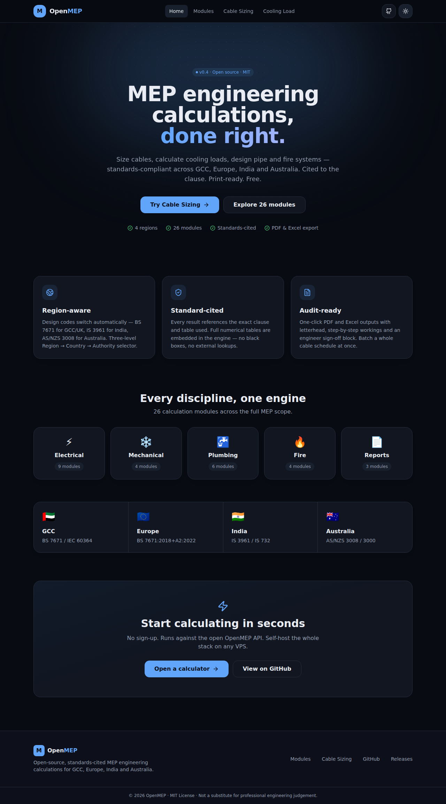
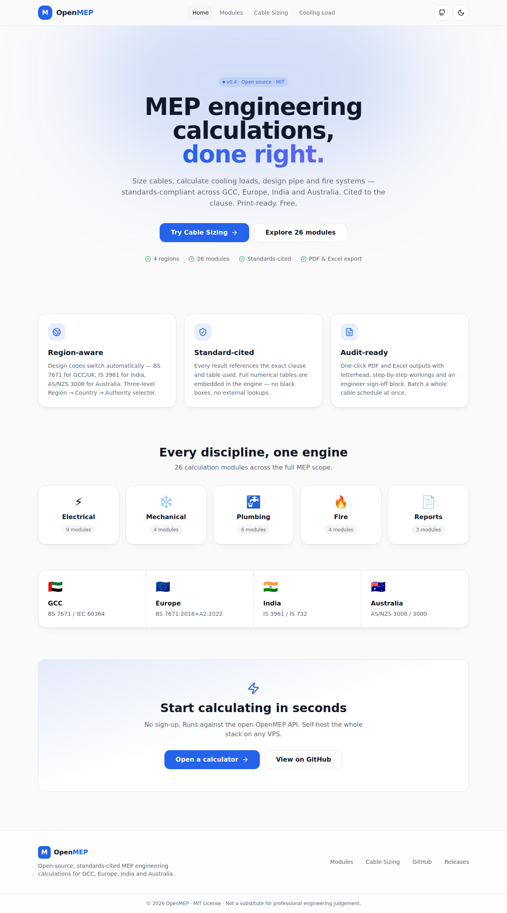
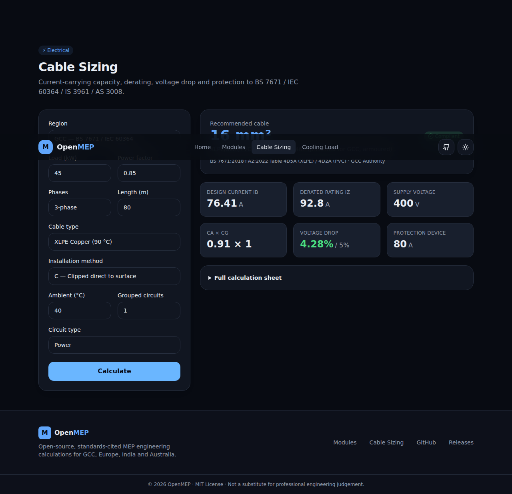
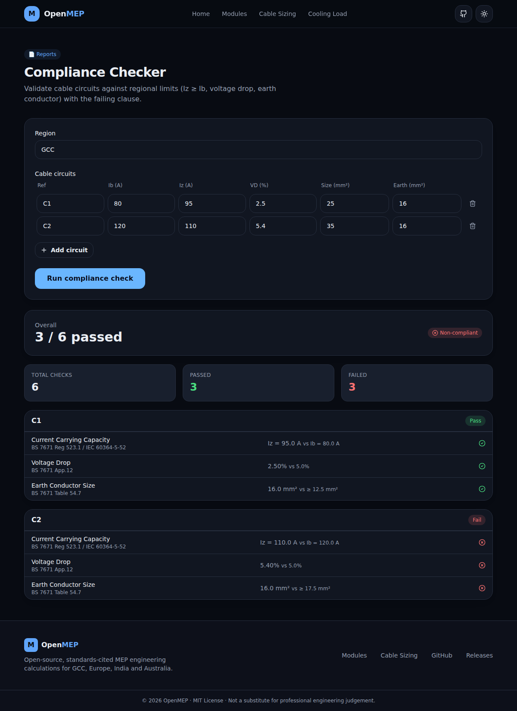
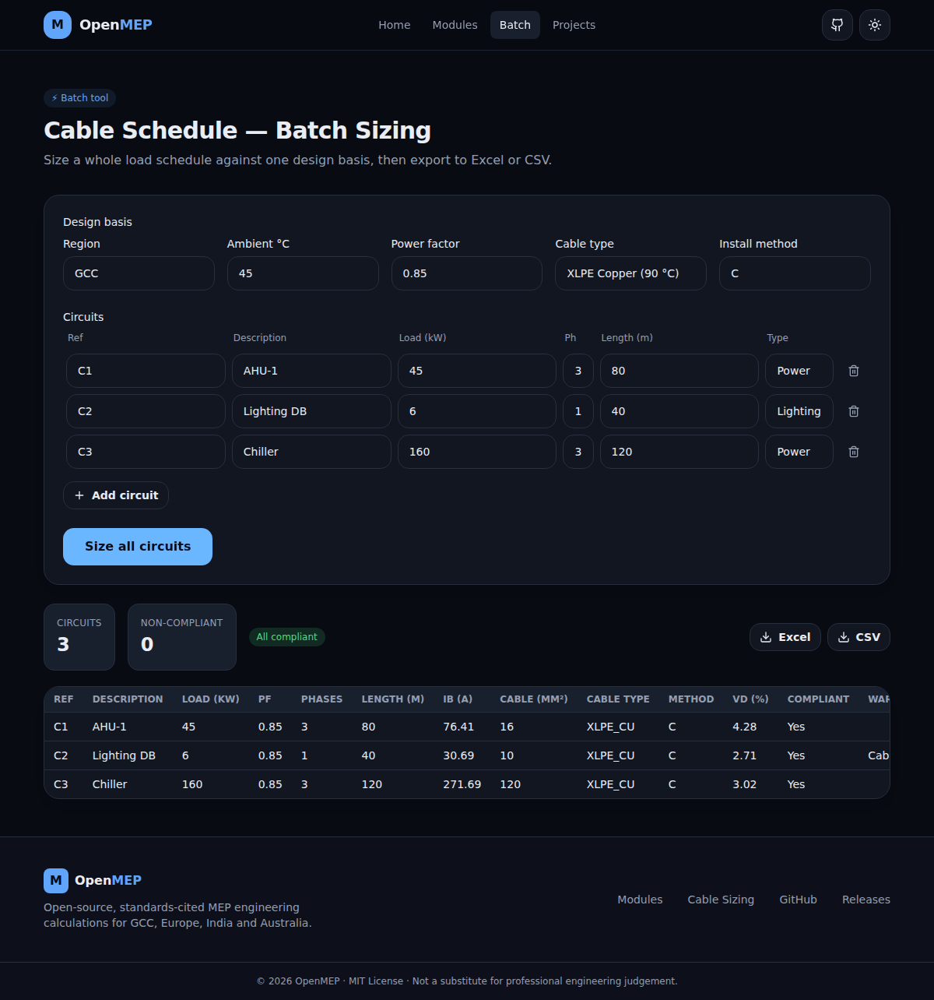

<div align="center">



# ⚡ OpenMEP Suite

### Open-source, standards-cited **MEP engineering calculations** — beautiful web app, powerful API

*Cable sizing · cooling loads · pipe & fire systems — compliant across **GCC, Europe, India & Australia**, cited to the clause, print-ready, and free.*

<br/>

[](https://github.com/kakarot-oncloud/openmep-suite/actions/workflows/ci.yml)
[](https://github.com/kakarot-oncloud/openmep-suite/releases)
[](LICENSE)


<br/>

**[🚀 Deploy in 1 command](#-deploy-anyone-can-do-this)** •
**[🧩 Modules](#-modules)** •
**[📸 Screenshots](#-screenshots)** •
**[🔌 API](#-api-in-30-seconds)** •
**[📖 Docs](docs/)**

</div>

---

## ✨ Why OpenMEP

> Commercial MEP tools cost **thousands per seat** and lock your results in proprietary formats. OpenMEP is free, open, and transparent.

| | |
|---|---|
| 🌍 **Region-aware** | Design codes switch automatically — BS 7671 / IEC 60364 (GCC & Europe), IS 3961 / IS 732 (India), AS/NZS 3008 / 3000 (Australia). |
| 📐 **Standard-cited** | Every result references the **exact clause and table**. Full numerical tables are embedded in the code — no black boxes. |
| 📄 **Audit-ready** | One-click PDF & Excel with letterhead, step-by-step workings, and an engineer sign-off block. |
| 🎨 **Beautiful UI** | A modern React web app — light **and** dark mode, works great on **mobile and desktop**. |
| 🐳 **Deploy anywhere** | One command with Docker, free cloud hosts, or your own VPS. |

---

## 📸 Screenshots

<table>
<tr>
<td width="50%"><br/><sub align="center"><b>Landing — light mode</b></sub></td>
<td width="50%"><br/><sub><b>Landing — dark mode</b></sub></td>
</tr>
<tr>
<td><br/><sub><b>Cable Sizing — cited result cards</b></sub></td>
<td><br/><sub><b>Compliance Checker — pass/fail by clause</b></sub></td>
</tr>
</table>

<div align="center"><br/><sub><b>Batch Cable Schedule → one-click Excel / CSV export</b></sub></div>

---

## 🧩 Modules

**26 standards-cited calculators & tools across five disciplines** — all live in the web app.

<table>
<tr><td valign="top" width="50%">

### 🔌 Electrical (9)
| Module | Standard |
|---|---|
| Cable Sizing | BS 7671 / IEC 60364 / IS 3961 / AS 3008 |
| Voltage Drop | IEC 60364-5-52 |
| Maximum Demand | IEE / DEWA / IS 18-1 |
| Short Circuit | IEC 60909 |
| Lighting Design | EN 12464-1 / CIBSE |
| Power Factor Correction | IEC 60831 |
| Generator Sizing | ISO 8528 |
| UPS Sizing | IEC 62040 |
| Panel Schedule | Multi-region |

### ❄️ Mechanical / HVAC (4)
| Module | Standard |
|---|---|
| Cooling Load | ASHRAE / CIBSE A |
| Duct Sizing | ASHRAE / CIBSE C |
| Heating Load | EN 12831 |
| Ventilation | ASHRAE 62.1 |

</td><td valign="top" width="50%">

### 🚰 Plumbing (6)
| Module | Standard |
|---|---|
| Pipe Sizing | BS EN 806 / IS 1172 |
| Drainage Sizing | BS EN 12056 |
| Pump Sizing | Darcy-Weisbach |
| Hot Water System | BS EN 806-3 |
| Rainwater Harvesting | BS 8515 / AS 3500 |
| Tank Sizing | BS EN 806 / IS 1172 |

### 🔥 Fire Protection (4)
| Module | Standard |
|---|---|
| Sprinkler Design | BS EN 12845 / NFPA 13 |
| Fire Pump Sizing | BS EN 12845 / NFPA 20 |
| Fire Storage Tank | BS 9251 / NBC 2016 |
| Standpipe System | NFPA 14 / BS 9990 |

### 📄 Reports & Compliance (3)
| Tool | What it does |
|---|---|
| BOQ Generator | Priced Bill of Quantities |
| Compliance Checker | Flags the failing clause |
| Report Builder | Audit-ready calc report |

</td></tr>
</table>

---

## 🌍 Region Support

| Region | Coverage | Standards | Design Ambient |
|---|---|---|---|
| 🇦🇪 **GCC** | UAE · KSA · Qatar · Kuwait · Bahrain · Oman | BS 7671, IEC 60364, DEWA / ADDC / SEC / KAHRAMAA | 50 °C |
| 🇪🇺 **Europe / UK** | UK · Ireland · Germany · France | BS 7671:2018+A2:2022, IEC 60364, CIBSE, EN 12831 | 30 °C |
| 🇮🇳 **India** | 8 utility zones | IS 3961, IS 732, IS 7098, NBC 2016, CPWD | 45 °C |
| 🇦🇺 **Australia / NZ** | All states + New Zealand | AS/NZS 3008, AS/NZS 3000, AS 3500, NCC | 40 °C |

---

## 🏗️ What's inside

| Service | Tech | Port | Role |
|---|---|---|---|
| 🎨 **Web app** | React + TypeScript + Tailwind | `3000` | The main interface — responsive, light/dark |
| ⚙️ **Calculation API** | FastAPI (Python 3.11) | `8000` | All 26 calculations — the single source of truth |
| 🗂️ **Project API** | Node.js / Express | `8080` | Project versioning, submission packaging, branding |
| 📊 **Streamlit UI** | Streamlit | `8501` | Legacy UI (still works) |

Built on the **Standards Adapter pattern**: identical calculation logic, swappable regional data. Adding a country means adding a data adapter, not rewriting engines.

---

## 🚀 Deploy (anyone can do this)

> **Not technical? Start here.** The Docker option below is genuinely copy-paste — three commands and you have the whole thing running.

### 🥇 Option 1 — Docker (recommended · one command)

**What you need:** [Docker Desktop](https://www.docker.com/products/docker-desktop/) installed (free — download, install, open it).

Then open a terminal and paste:

```bash
git clone https://github.com/kakarot-oncloud/openmep-suite.git
cd openmep-suite
docker compose up -d
```

Wait ~1–2 minutes, then open **http://localhost:3000** in your browser. That's it. 🎉

| Open this | To get |
|---|---|
| **http://localhost:3000** | 🎨 The web app (start here) |
| http://localhost:8000/docs | ⚙️ API explorer (Swagger) |
| http://localhost:8501 | 📊 Streamlit UI |

To stop: `docker compose down`.

### 🥈 Option 2 — Free cloud hosting (no server to manage)

Great if you want a public link without owning a server. Full click-by-click guides are in **[docs/DEPLOYMENT.md](docs/DEPLOYMENT.md)**:

| Platform | Best for | Cost |
|---|---|---|
| **[Render](docs/DEPLOYMENT.md#render)** | Easiest cloud, click-based | Free tier |
| **[Railway](docs/DEPLOYMENT.md#railway)** | One-click from GitHub | Free trial |
| **[Fly.io](docs/DEPLOYMENT.md#flyio)** | Global, fast | Free allowance |
| **[Vercel / Netlify](docs/DEPLOYMENT.md#vercel--netlify)** | Web app only (static) | Free |
| **[Streamlit Cloud](docs/DEPLOYMENT.md#streamlit-community-cloud)** | The Streamlit UI, free | Free |

### 🥉 Option 3 — Your own server (VPS) with a real domain + HTTPS

For a production site on DigitalOcean / Hetzner / AWS Lightsail — a step-by-step, beginner-friendly walkthrough (install Docker, clone, run, point your domain, automatic HTTPS) is in **[docs/DEPLOYMENT.md#vps](docs/DEPLOYMENT.md#vps)**.

### 🧪 Option 4 — Just try it locally (developers)

```bash
# 1) API
pip install -r requirements.txt
uvicorn backend.main:app --port 8000
# 2) Web app (new terminal)
cd frontend && npm install && npm run dev   # → http://localhost:5173
```

### ☁️ Option 5 — Zero install (Google Colab)

[](https://colab.research.google.com/github/kakarot-oncloud/openmep-suite/blob/main/colab_launcher.ipynb)

👉 **Full guide for every platform:** **[docs/DEPLOYMENT.md](docs/DEPLOYMENT.md)**

---

## 🔌 API in 30 seconds

Every calculation is a simple JSON request. Examples are validated against the live API — full reference in [docs/API_DOCS.md](docs/API_DOCS.md).

```bash
# Cable sizing — GCC/DEWA, 45 kW, XLPE/Cu, 80 m run
curl -X POST http://localhost:8000/api/electrical/cable-sizing \
  -H "Content-Type: application/json" \
  -d '{"region":"gcc","sub_region":"dewa","load_kw":45,"power_factor":0.85,
       "phases":3,"cable_type":"XLPE_CU","installation_method":"C",
       "cable_length_m":80,"ambient_temp_c":40}'
```

```bash
# Sprinkler design — Ordinary Hazard 1
curl -X POST http://localhost:8000/api/fire/sprinkler \
  -H "Content-Type: application/json" -d '{"occupancy_hazard":"OH1","area_protected_m2":600}'
```

**Rate limits:** 60 req/min per IP (10/min for report generation). Optional `X-API-Key` auth — set `API_KEY` to require it.

---

## ⚙️ Configuration

All settings are environment variables (see [`.env.example`](.env.example)).

| Variable | Default | Purpose |
|---|---|---|
| `API_KEY` | *(unset)* | Require `X-API-Key` on all calculation endpoints |
| `ALLOWED_ORIGINS` | `localhost` | Comma-separated CORS allow-list |
| `VITE_API_BASE` | same-origin | Backend URL the web app calls (build-time) |
| `OPENMEP_DB_PATH` | `openmep_data.db` | SQLite file for the persistent project store |
| `POSTGRES_PASSWORD` | `openmep_local_dev` | DB password (**change for production**) |

---

## 🧪 Testing

**167 automated backend tests (~84 % coverage)**, run in CI on every push and PR alongside frontend lint/build and the Node service tests.

```bash
pytest                                  # backend
ruff check backend/ streamlit_app/      # backend lint
cd frontend && npm run lint && npm run build   # web app
```

---

## 🗂️ Project Structure

```
openmep-suite/
├── frontend/        🎨 React + TS + Tailwind web app (the main UI)
├── backend/         ⚙️ FastAPI calculation engine
│   ├── engines/         pure-Python calculation engines
│   ├── adapters/        regional standards adapters (gcc · europe · india · australia)
│   ├── standards_data/  embedded standards tables (JSON)
│   └── tests/           167 tests
├── src/             🗂️ Node.js/TypeScript project API
├── streamlit_app/   📊 Streamlit UI (legacy)
├── docs/            📖 API, deployment, user & standards guides
├── docker-compose.yml   🐳 one-command full stack
└── .github/workflows/   ✅ CI (Python · Node · Web build)
```

---

## 🗺️ Roadmap

**✅ Shipped (v0.4)** — full React web app (all 26 modules, light/dark, responsive), persistent projects, batch sizing, CSV/Excel export, optional API-key auth.

**🔜 Next** — Postgres backend option · BIM/IFC & Revit-CSV bridge · value-engineering optimizer · North America (NEC / CEC / ASHRAE 90.1).

---

## 🤝 Contributing

```bash
git checkout -b feature/my-feature
pip install -r requirements.txt -r requirements-dev.txt
pytest && ruff check backend/            # backend must pass
cd frontend && npm run lint && npm run build   # web app must pass
```

See [CONTRIBUTING.md](CONTRIBUTING.md) · [CODE_OF_CONDUCT.md](CODE_OF_CONDUCT.md) · [SECURITY.md](SECURITY.md).

---

## 📄 License

Released under the [MIT License](LICENSE).

<div align="center">
<br/>
<sub>⚡ <b>OpenMEP Suite</b> · built for MEP engineers · standards-cited, open source · not a substitute for professional engineering judgement</sub>
</div>
